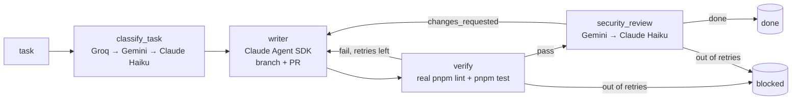

# orchestrator

A multi-agent coding pipeline: give it a task in plain English and it classifies
it, writes the code in the right repo (Claude Agent SDK), proves the result with
the repo's own lint and tests, has a *different* model family review the diff,
and opens a pull request. Cross-cutting tasks are split per repo and run in
parallel. A small web dashboard shows every run live.

Built with [LangGraph](https://github.com/langchain-ai/langgraph) (coordination),
the [Claude Agent SDK](https://github.com/anthropics/claude-agent-sdk-python)
(the agent that writes code), FastAPI + WebSockets (live events) and a
React/TypeScript dashboard.

> **Status: personal project, local use only.** It runs real commands against
> your real repos and the control server has **no authentication yet**. Read
> [Safety model](#safety-model) before running it anywhere but your own machine.

## How a run works



- **Cheap models for cheap decisions.** `classify_task` is a single structured-JSON
  call, so it tries Groq, then Gemini, and only falls back to Claude Haiku if both
  fail.
- **A different model reviews the code.** `security_review` reads
  `git diff <target>...<branch>` and sends it to Gemini; a second Claude call
  reviewing Claude's output shares its blind spots. Claude Haiku (agentic, can
  read the repo) is the fallback.
- **Verification is a real exit code, not an opinion.** `verify` runs `pnpm lint`
  and then `pnpm test` as subprocesses in the target repo. The review step is never
  spent on a diff that fails its own checks.
- **Two independent retry budgets** (2 each, in `nodes.py`): failed verification
  and `changes_requested` reviews both loop back to `writer`, which checks out the
  branch it already pushed and fixes exactly what was reported. It never starts over
  or opens a second PR.
- **Parallel multi-repo tasks.** With `--lead`, a planning call splits one
  high-level task into per-repo subtasks (`lead.py`) and runs the graph for each
  concurrently with `asyncio.gather`. Each subtask gets its own `run_id`.
- **Observability.** Every provider call writes a cost/token row, and every graph
  event is persisted and broadcast over WebSocket (`events.py`, `telemetry.py`), so
  the dashboard can show live progress *and* history.

## Requirements

- Python 3.12 (LangGraph has had compatibility problems with 3.13+).
- [`uv`](https://docs.astral.sh/uv/) (recommended) or `pip`.
- `pnpm` and the [GitHub CLI](https://cli.github.com/) (`gh auth login`) - the
  pipeline shells out to both.
- Claude access: `claude login` (subscription) **or** `ANTHROPIC_API_KEY`.
- `GROQ_API_KEY` and `GEMINI_API_KEY` (free tiers work).
- Optional, for run history and the dashboard: a Postgres database (see
  [Database](#database)).

## Quick start

```bash
git clone <this repo> && cd orchestrator
uv sync                      # or: python -m venv .venv && pip install -r requirements.txt
cp .env.example .env         # then fill in your own keys - .env is gitignored
```

Run one task against one repo:

```bash
uv run main.py --repo backend --task "Add a DELETE /listings/:id endpoint"
```

Let the orchestrator split a cross-cutting task across repos and run them in parallel:

```bash
uv run main.py --lead --task "Add a favorites feature: backend endpoint + UI toggle"
```

Other flags: `--task-file <path>` (long task descriptions), `--branch <name>
--pr-url <url>` (continue fixing an existing PR instead of opening a new one).

### Run it from inside a repo

If `--repo` is omitted, `main.py` matches your current directory against the
registered repos (it also works from a subdirectory). A shell helper makes this
convenient:

```bash
# ~/.zshrc  (point ORCH_DIR at your checkout of this repo)
orc() { uv run --project "$ORCH_DIR" "$ORCH_DIR/main.py" --task "$*"; }
```

```bash
cd ../frontend-shell && orc "add a 'phone' field to the registration form"
```

(`--project` tells uv where the virtualenv is without changing the working
directory, which `detect_repo_from_cwd()` relies on.)

## Dashboard

```bash
# terminal 1 - API + WebSocket (binds to 127.0.0.1 by default; keep it that way)
uv run uvicorn control_server:app

# terminal 2 - UI
cd dashboard && cp .env.example .env && pnpm install && pnpm dev   # http://localhost:5173
```

It lets you trigger a task, shows runs as they progress node by node, keeps the
history across restarts, shows the PR status (open / merged / closed) and
per-run token and cost telemetry. Runs move from **Active** to **History** once
their PR is merged or you mark a stalled run as done.

API surface (`control_server.py`): `POST /runs`, `GET /runs`,
`GET /runs/{run_id}/metrics`, `GET /pr-status`, `GET /repos`, `POST /runs/complete`,
`POST /runs/pr-merged`, `GET /ping`, and `WS /ws`.

The frontend is organised by feature (`src/features/{runs,trigger-form,connection-status}`)
rather than by file type; `App.tsx` is only a composition root.

> **Known limitation:** the dashboard imports `@szczypkaweb/shared-ui` from GitHub
> Packages, which requires a token even to install. Outsiders cannot
> `pnpm install` it yet; publishing the UI kit to the public npm registry is on the
> to-do list.

## Database

Run history, telemetry and PR-merge persistence use Postgres via `asyncpg`
(`DATABASE_URL`). The tables (`ExecutionMetric`, `RunEvent`, `OrchestratorRun`) are
currently defined and migrated by a sibling project's Prisma schema, not by this
repo. Without a database:

- the CLI still works - telemetry writes are best-effort and only log a warning;
- `GET /runs` and the dashboard's history/metrics views will fail.

A self-contained schema (`schema.sql`) is a to-do.

## Configuring the repos it can operate on

`repos.py` is the registry: for each repo it holds the path, a description of the
stack and conventions (given to the writer), a `review_focus` checklist (given to
the reviewer) and the `target_branch` PRs are opened against. Repos are expected
to be **sibling directories** of this one. The registry currently describes the
author's own projects - to use it on yours, edit `REPOS` (and keep the descriptions
specific: they are the main lever on output quality). Each target repo's own
`CLAUDE.md` and `.claude/skills/` are loaded by the writer, so project conventions
live in the target repo, not here. Moving the registry to a YAML config file is a
to-do.

## Tests and linting

```bash
uv run pytest                 # unit tests (asyncio_mode=auto)
uv run ruff check .           # lint (rule set E, F, I - see pyproject.toml)
cd dashboard && pnpm lint && pnpm build   # oxlint + tsc -b + vite build
```

The Python suite covers the control-server endpoints (using FastAPI's
`TestClient` with the broadcast layer stubbed) and the telemetry/persistence layer
(with `asyncpg` mocked), so it needs neither a database nor any API keys. There is
no automated test coverage of the LLM nodes themselves; they are exercised by real
runs. There is no CI workflow in this repo yet.

## Safety model

Be explicit about what this tool does, because it is the reason it is not public-facing:

- The **writer agent has `Bash`, `Edit` and `Write`** inside the target repo, and
  `verify` runs `pnpm lint` / `pnpm test` there. That is arbitrary code execution
  driven by the task text, with your user's permissions and your repo's
  dependencies. There is **no sandbox**.
- The **control server has no authentication**. Anyone who can reach it can start
  runs. It binds to localhost by default and CORS only allows the dashboard origin
  (`DASHBOARD_ORIGIN`), which is not a security boundary against non-browser
  clients. **Do not expose it to a network, tunnel, or the public internet** until
  runs execute in an isolated environment and requests are authenticated.
- Only give it tasks you wrote, against repos you trust. Treat task text like a
  shell command.
- Secrets live only in `.env` (gitignored). Never commit it; `.env.example` holds
  placeholders only.

Planned hardening: ephemeral sandboxed execution, authentication on the control
server, and CI secret scanning.

## Repository layout

| Path | Purpose |
|---|---|
| `graph.py`, `state.py` | LangGraph definition and shared run state |
| `nodes.py` | `classify_task`, `run_writer`, `run_verification`, `run_security_review` and routing |
| `lead.py` | Splits a task across repos and runs subtasks in parallel |
| `repos.py` | Registry of repos the orchestrator can operate on |
| `providers.py`, `retry.py`, `schemas.py` | Provider clients, retry helper, structured-output schemas |
| `events.py`, `telemetry.py` | Event broadcast/persistence and cost telemetry |
| `github.py` | PR status through the `gh` CLI |
| `control_server.py` | FastAPI HTTP + WebSocket API for the dashboard |
| `dashboard/` | React + TypeScript + Vite dashboard |
| `skills/` | Example Claude skill loaded by the writer |
| `test_*.py` | Python tests |

## License

MIT
